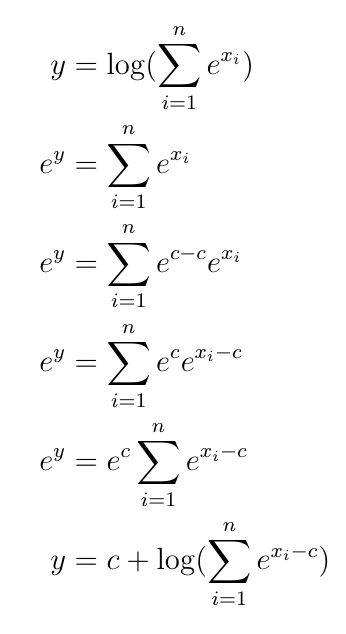

<!-- README.md is generated from README.Rmd. Please edit that file -->

# logProbs

<!-- badges: start -->
<!-- badges: end -->

The goal of logProbs is to provide basic functionality to deal with unnormalized log
probabilities and illustrate the need for a numerically stable way to calculate the log normalization constant.
It does this through implementing two functions that calculate normalized probabilities from unormalized log probabilities:

1) `normalize_log_probs` (naive numerically unstable)

2) `stable_noramlize_log_probs` (numerically stable version)

## Motivation

The first release of this package (assignment-2b) has a goal of being a simple package that deals with unormalized log probabilities.
However, I found when using it's function I would get numerical errors occuring when I used `exp()` on large values resulting in numerical overflow!
I addressed this issue in the latest version of this package (assignment-5b). 
That is, there is a nice trick where we can shift the log likelihoods to ensure that we don't use `exp()` on large values!
Please look at the proofs section to get a good understanding of this mathematical trick.

## Installation

You can install the released version of logProbs using `devtools` with:

    devtools::install_github("matteolepur/logProbs", build_vignettes = TRUE, ref = "1.1.0")

## Example

This is a basic example which shows you how to solve a common problem:

    library(logProbs)

    normalize_log_probs(c(-10, -10, -10))
    #> [1] 0.3333333 0.3333333 0.3333333
    stable_normalize_log_probs(c(-10, -10, -10))
    #> [1] 0.3333333 0.3333333 0.3333333
    normalize_log_probs(c(-1000, -1000, -1000))
    #> Error in normalize_log_probs(c(-1000, -1000, -1000)) : 
    #> The sum of normalized probabilities is outside the range of (1.0 - threshold, 1.0 + threshhold). We suggest the stable_normalize_log_probs().
    stable_normalize_log_probs(c(-1000, -1000, -1000))
    #> [1] 0.3333333 0.3333333 0.3333333
 
 ## Small Proof
 
Ultimately, we need to compute the log normalization constant to normalize the log probabilities, then exponentiate them to obtain a simplex of probabilities. Let x_i be the i log probability and y be the log normalization constant.

Notice that we can control the magnitude of the value we are exponentiating x_i - c by selecting c in the real numberline and therefore avoid numerical overflow. We will select c to be the max x_i to ensure that the largest value we obtain in the summation is 1.
    
Look at previous pushes for explanations of Exercise 1.1.
